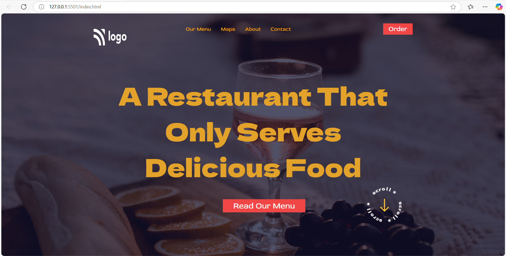

# Project-2 | Restaurant page
A statc web page of Restaurant brochure using HTML CSS.

## Screenshots

## What I learned from this Project
- This project gave me good learning experience about how html and css works.
- I learned how to use HTML and CSS to create a beautiful website.
- I learned about the ways of positioning elements in the HTML and CSS.
## Live Project
[https://assignment-1-blue-nine.vercel.app/](https://html-css-project-2-omega.vercel.app/)

## Time taken to finish this project
- 4 hour to complete it.
